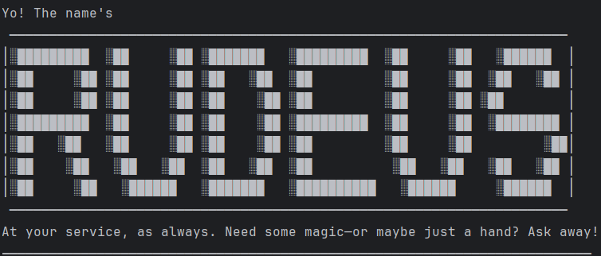

# Rudeus Chatbot User Guide

Welcome to Rudeus, your magical command-line task manager inspired by Rudeus Greyrat from Jobless Reincarnation!

────────────────────────────────────────────────────────────

## Quick Start
Launch Rudeus and type commands directly. Here’s what you can do:

| Command                                | Example                                                         | What it does                             |
|----------------------------------------|-----------------------------------------------------------------|------------------------------------------|
| `todo DESCRIPTION`                     | `todo return book`                                              | Adds a simple todo task                  |
| `deadline DESCRIPTION /by DT`          | `deadline return book /by 2025-10-02T18:00`                     | Adds a task with a deadline              |
| `event DESCRIPTION /from DT /to DT`    | `event return book /from 2025-10-02T18:00 /to 2025-10-02T19:00` | Adds an event with start and end times   |
| `list`                                 | `list`                                                          | Shows all tasks                          |
| `mark INDEX` or `mark DESCRIPTION`     | `mark 1` or `mark return book`                                  | Marks a task as done                     |
| `unmark INDEX` or `unmark DESCRIPTION` | `unmark 1` or `unmark return book`                              | Marks a task as not done                 |
| `delete INDEX` or `delete DESCRIPTION` | `delete 1` or `delete return book`                              | Removes a task                           |
| `find KEYWORD`                         | `find return book`                                              | Searches tasks by description            |
| `bye`                                  | `bye`                                                           | Exits Rudeus                              |

────────────────────────────────────────────────────────────

## Features
- **Add, list, mark, unmark, delete, and find tasks** with simple commands.
- **Three task types**: Todo, Deadline, Event.
- **Persistent storage**: Your tasks are saved automatically and reloaded when you return.
- **Search by task description**: Quickly find what you need.
- **Expressive feedback**: Rudeus responds with playful and clear messages.

────────────────────────────────────────────────────────────

## Examples

Add a Todo
----------
Adds a simple todo task.

Usage:
todo <description>

Example:
todo Finish CS assignment

Expected Output:
────────────────────────────────────────────────────────────

added: [T][ ] Finish CS assignment

────────────────────────────────────────────────────────────

Add a Deadline
--------------
Adds a task with a deadline.

Usage:
deadline <description> /by <due date>

Example:
deadline Submit report /by Friday

Expected Output:
────────────────────────────────────────────────────────────

added: [D][ ] Submit report (by: Friday)

────────────────────────────────────────────────────────────

Add an Event
------------
Adds an event with a start and end time.

Usage:
event <description> /from <start> /to <end>

Example:
event Project meeting /from Monday 2pm /to Monday 4pm

Expected Output:
────────────────────────────────────────────────────────────

added: [E][ ] Project meeting (from: Monday 2pm to: Monday 4pm)

────────────────────────────────────────────────────────────

List Tasks
----------
Shows all tasks in your list.

Usage:
list

Expected Output:
────────────────────────────────────────────────────────────

Here are the tasks in your list:

1. [T][ ] Finish CS assignment
2. [D][ ] Submit report (by: Friday)
3. [E][ ] Project meeting (from: Monday 2pm to: Monday 4pm)

────────────────────────────────────────────────────────────

Mark/Unmark Tasks
-----------------
Marks a task as done or not done.

Usage:
mark <task number>
unmark <task number>

Example:
mark 2

Expected Output:
────────────────────────────────────────────────────────────

Nice! I've marked this task as done:

[D][X] Submit report (by: Friday)

────────────────────────────────────────────────────────────

Delete Tasks
------------
Deletes a task from your list.

Usage:
delete <task number>

Example:
delete 1

Expected Output:
────────────────────────────────────────────────────────────

Alright, I've erased this task from existence:

[T][ ] Finish CS assignment

Now you have 2 task(s) left in the list.

────────────────────────────────────────────────────────────

Find Tasks
----------
Finds tasks containing a keyword.

Usage:
find <keyword>

Example:
find report

Expected Output:
────────────────────────────────────────────────────────────

Here are the matching tasks in your list:

1. [D][X] Submit report (by: Friday)

────────────────────────────────────────────────────────────

Exit
----
Ends the program.

Usage:
bye

Expected Output:
────────────────────────────────────────────────────────────

See you around! Don’t get into too much trouble without me!

────────────────────────────────────────────────────────────

Save and Load
-------------
Tasks are automatically saved to disk and loaded when you start Rudeus.
No manual action is needed!

How Saving and Loading Works:
-----------------------------
- All tasks are saved to the file `data/tasks.txt` in your project directory.
- When you start Rudeus, it automatically loads tasks from this file.
- When you add, mark/unmark, or delete a task, the file is updated automatically.

────────────────────────────────────────────────────────────

Error Handling
--------------
Rudeus will let you know if you enter an invalid command or forget required details, always with a bit of personality!

────────────────────────────────────────────────────────────

## FAQ

Q: Where are my tasks saved?

A: In the data/tasks.txt file in your project directory.

Q: What happens if I enter an invalid command?

A: Rudeus will respond with a friendly error message.

────────────────────────────────────────────────────────────

## Contact

For bugs or suggestions, open an issue on GitHub!

────────────────────────────────────────────────────────────

### Have fun organizing your tasks with Rudeus!